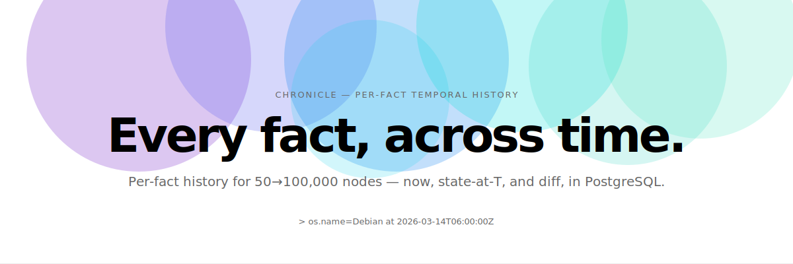

<picture>
  <source media="(prefers-color-scheme: dark)" srcset="docs/assets/hero-dark.svg">
  
</picture>

<p align="center">
  <a href="https://github.com/ncode/chronicle/actions/workflows/unit_tests.yaml"></a>
  <a href="https://goreportcard.com/report/github.com/ncode/chronicle"></a>
  <a href="https://pkg.go.dev/github.com/ncode/chronicle"></a>
  
  <a href="https://opensource.org/licenses/Apache-2.0"></a>
</p>

<p align="center">
  <samp><a href="#the-shape-of-it">Architecture</a> · <a href="#ask-across-time">Query</a> · <a href="#built-and-tested-where-it-runs">Platforms</a> · <a href="#go-deeper">Documentation</a></samp>
</p>

<br>

Chronicle continuously collects system facts from a fleet of **50 → 100,000 nodes** (via [`ncode/facts`](https://github.com/ncode/facts)) and stores their **per-fact temporal history** in PostgreSQL — so you can ask what the fleet looks like *now*, what node X looked like *at time T*, and what *changed* (including removals) between two moments.

[`facts`](https://github.com/ncode/facts) discovers, [`facts-ca`](https://github.com/ncode/facts-ca) authenticates node identity over mTLS, and chronicle adds the part neither has: per-fact history over time. **Dumb node, smart center** — each node runs a thin agent that pushes a snapshot; all the intelligence lives in the center.

<br>

<samp>ARCHITECTURE</samp>

## The shape of it.

```
 chronicle-agent (per node)                    chronicle (server, stateless, replicable)
 ┌───────────────────────┐   facts-ca mTLS     ┌──────────────────────────────────────┐
 │ facts.Discover()      │  POST /v1/push      │ ingest  : CN-from-chain identity,     │
 │ + producer_timestamp  │ ──────────────────► │           two-sided clock guard,      │   ┌────────────┐
 │ + discovery status    │                     │           per-node serialized apply   │──►│ PostgreSQL │
 │ jittered timer, retry │                     │ store   : change-only temporal model  │   │ (temporal) │
 └───────────────────────┘                     │ query   : DSL + node_diff (OIDC/token)│◄──│            │
                                               │ lifecycle: expiry + deactivation      │   └────────────┘
   people / automation  ── bearer token ─────► │ ops     : /healthz /readyz /metrics   │
 (OIDC or static API token, server-TLS, no cert)└──────────────────────────────────────┘
```

Facts are stored as **validity intervals** (`[valid_from, valid_to)`, `valid_to = 'infinity'` = current). Only *changes* are written, so 100k nodes cost tens of GB/year instead of tens of TB. Churny facts (`uptime`, free memory, load) are kept latest-only and never historized. Machines push over facts-ca mTLS (identity is the verified cert CN — a node cert can never read); people read on a separate endpoint with OIDC/bearer tokens.

<br>

<samp>QUERY</samp>

## Ask across time.

A small purpose-built DSL over temporal-encapsulating views — every shape takes an optional `at <T>`, so point-in-time forensics are first-class:

```
role=web os.name=Debian                       # nodes matching, right now
os.name=Debian at 2026-03-14T06:00:00Z        # …which nodes were Debian that morning
role where os.name='Debian' group by role     # distribution across the matching set
```

Per-node change history is its own endpoint, and it surfaces removals — a tombstone is a close with no matching open:

```
GET /v1/node/web01.example.com/diff?from=2026-03-01T00:00:00Z&to=2026-03-15T00:00:00Z
```

<br>

<samp>COLLECT</samp>

## Dumb node, smart center.

The agent runs `facts.Discover()` on a jittered timer, stamps a `producer_timestamp`, attaches a per-source discovery-status report, and pushes over mTLS — no inbound port, no durable spool. The server keys identity off the verified certificate CN (never the body), applies a two-sided clock guard, classifies Durable vs Volatile centrally, and applies the whole snapshot in one per-node serialized transaction.

You can see exactly what a node would send, on any OS, with no server or certs:

```sh
chronicle-agent -dry-run        # discover facts once, print the push payload
```

<br>

<samp>PLATFORMS</samp>

## Built and tested where it runs.

The **agent** runs everywhere [`facts`](https://github.com/ncode/facts) runs; the **server** runs everywhere PostgreSQL-capable Go runs (the same set minus Plan 9). Both are pure-Go (`CGO_ENABLED=0`) and cross-compiled for every target. The agent is functionally gated — `facts.Discover()` → snapshot — on each platform.

| Platform | Architectures | Agent | Server | Gate |
| --- | --- | :---: | :---: | --- |
| Linux | x64, arm64 | ✅ | ✅ | native runners + Postgres integration |
| macOS | arm64, x64 | ✅ | ✅ | native runners |
| Windows | Server 2022, 2025 | ✅ | ✅ | native runners |
| FreeBSD | amd64, arm, arm64 | ✅ | ✅ | VM job (amd64) + cross-compile |
| OpenBSD | amd64, arm, arm64 | ✅ | ✅ | VM job (amd64) + cross-compile |
| NetBSD | amd64, arm, arm64 | ✅ | ✅ | VM job (amd64) + cross-compile |
| DragonFly BSD | amd64 | ✅ | ✅ | VM job |
| illumos | amd64 | ✅ | ✅ | VM job |
| Plan 9 | amd64 | ✅ | — | cross-compile |

Requires Go 1.26+ and PostgreSQL.

<br>

<samp>DOCS</samp>

## Go deeper.

| | |
| --- | --- |
| [openspec/changes/chronicle-v1/](openspec/changes/chronicle-v1/) | the spec-driven change — proposal, capability specs, design, tasks |
| [CONTEXT.md](CONTEXT.md) · [docs/adr/](docs/adr/) | the project's language and the eleven architectural decisions |
| [docs/schema/v1.sql](docs/schema/v1.sql) | the temporal schema |
| [docs/runbook.md](docs/runbook.md) | operations: migrations, enrollment ramp, backpressure, deactivation, watermark reset, CRL, alarms |
| [pkg.go.dev/github.com/ncode/chronicle](https://pkg.go.dev/github.com/ncode/chronicle) | API reference |

<br>

<samp>DEVELOPING</samp>

## Working on chronicle.

```sh
make build           # both binaries (chronicle, chronicle-agent)
make test            # unit tests (integration self-skips without a DB)
make test-db         # spin a throwaway Postgres and run the full suite
make race            # race detector over the concurrency-sensitive packages
make cross-compile   # build both binaries for every supported os/arch
make dist            # checksummed release archives for every target
```

The integration tests need PostgreSQL; set `CHRONICLE_TEST_DB` to a pgx connstring, or use `make test-db`. They share one database, so they run with `-p 1`.

<br>

---
